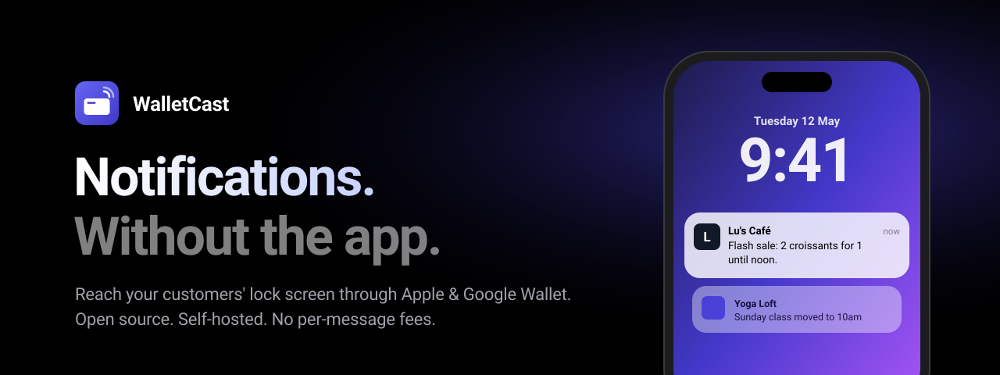
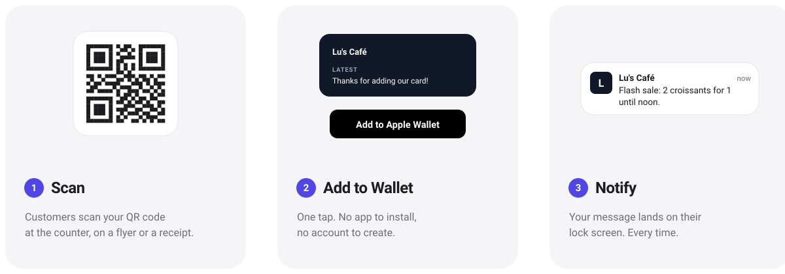
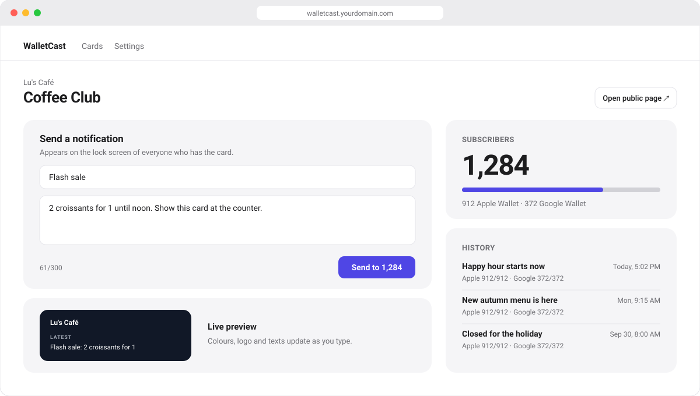
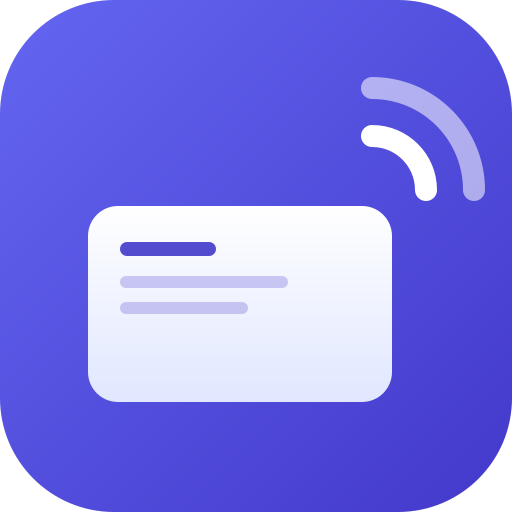

<div align="center">



<br/>
<br/>

<a href="https://vercel.com/new/clone?repository-url=https%3A%2F%2Fgithub.com%2Fadrbn%2Fwalletcast&env=DATABASE_URL,BASE_URL,ADMIN_PASSWORD,SESSION_SECRET&envDescription=Postgres%20URL%2C%20your%20public%20URL%2C%20an%20admin%20password%20and%20a%20random%20session%20secret&envLink=https%3A%2F%2Fgithub.com%2Fadrbn%2Fwalletcast%2Fblob%2Fmain%2Fdocs%2Fdeploy.md&project-name=walletcast"></a>
<a href="#run-it-with-docker"></a>
<a href="https://github.com/adrbn/walletcast/archive/refs/heads/main.zip"></a>

<br/>

[](docs/setup-apple.md)
[](docs/setup-google.md)
[](docs/deploy.md)
[](LICENSE)
[](https://github.com/adrbn/walletcast/actions/workflows/ci.yml)

**[How it works](#how-it-works) · [Features](#everything-you-need) · [Get started](#get-started) · [FAQ](#faq) · [Support](#support-the-project)**

</div>

<br/>

**WalletCast turns Apple Wallet and Google Wallet into your own push-notification channel.** Customers scan a QR code and add your card in one tap. From then on, every message you send lands on their lock screen, just like an app notification.

You don't need an app, an App Store listing or customer accounts. Wallet-marketing platforms charge a monthly fee for this. WalletCast is free, open source, and runs on your own server.

<br/>

## How it works

<picture>
  <source media="(prefers-color-scheme: dark)" srcset="docs/assets/how-it-works-dark.svg">
  
</picture>

<br/>

## Your whole channel on one screen

<picture>
  <source media="(prefers-color-scheme: dark)" srcset="docs/assets/dashboard-dark.svg">
  
</picture>

<div align="center"><sub>Write, send, and see how many wallets your message reached, all from one page.</sub></div>

<br/>

## Everything you need

<table>
<tr>
<td width="50%" valign="top">

### 🔔 Lock-screen notifications
Send a message and it appears on every customer's lock screen, on iPhone and Android.

</td>
<td width="50%" valign="top">

### 🎨 Your brand, live
Choose colours, logo, icon and text, and watch the card update as you type.

</td>
</tr>
<tr>
<td valign="top">

### 📱 One-tap add
Your public page detects the phone and shows the right **Add to Wallet** button. Collecting an email is optional.

</td>
<td valign="top">

### 🏷️ QR codes that tell you what works
Download PNG or SVG codes tagged by placement (`window`, `flyer`, `receipt`…) and see which one brings the most people.

</td>
</tr>
<tr>
<td valign="top">

### 📊 Delivery you can see
Subscriber counts per wallet, full message history, and delivery stats for every send.

</td>
<td valign="top">

### 🔒 Your data stays yours
Subscribers and history live in your database, and you can export everything as CSV whenever you like. There is no tracking and no middleman.

</td>
</tr>
<tr>
<td valign="top">

### 💸 No per-message fees
Send as often as you like. Your only costs are hosting and Apple's developer fee.

</td>
<td valign="top">

### ⚡ Zero-setup database
An embedded database works out of the box. Connect Postgres when you grow.

</td>
</tr>
</table>

<br/>

## Made for

| | |
|---|---|
| ☕ **Cafés & restaurants** | Daily specials, happy hour, "we're open late tonight" |
| 🛍️ **Shops** | Flash sales, new arrivals, restock alerts |
| 🧘 **Studios & gyms** | Schedule changes, new classes, last spots left |
| 🎟️ **Events & venues** | Doors open, line-up updates, last-minute changes |
| 🚀 **Creators & founders** | A direct line to your community, without a newsletter or social feed |

<br/>

## Get started

### What you need

| | Cost | Setup |
|---|---|---|
|  | Apple Developer Program, $99/year | [10-minute guide →](docs/setup-apple.md) |
|  | Free | [Step-by-step guide →](docs/setup-google.md) |
| A server with HTTPS | Free tiers work (Vercel + Neon) | [Deploy guide →](docs/deploy.md) |

You can start with one wallet and add the other later. The dashboard works without either, so you can design your card first.

### Deploy in one click

Click **Deploy to Vercel** at the top of this page, then add a free Postgres database from [Neon](https://neon.tech). Fill in four values when Vercel asks for them, and you're live.

### Run it with Docker

```bash
git clone https://github.com/adrbn/walletcast.git && cd walletcast
cp .env.example .env        # set ADMIN_PASSWORD, SESSION_SECRET and BASE_URL
docker compose up -d
```

Open `https://your-domain/dashboard`, sign in, and create your first card. [docs/deploy.md](docs/deploy.md) covers HTTPS with Caddy, backups and updates.

### Try it locally

```bash
pnpm install
cp .env.example .env.local
pnpm dev                    # http://localhost:3000/dashboard
```

To test on a real iPhone, expose your machine over HTTPS (for example with `ngrok http 3000`) and set `BASE_URL` to the tunnel address.

<br/>

## FAQ

<details>
<summary><b>Do my customers need to install anything?</b></summary>
<br/>
No. Apple Wallet is built into every iPhone, and Google Wallet comes with most Android phones. Customers tap <b>Add to Wallet</b> and they're done.
</details>

<details>
<summary><b>How many notifications can I send?</b></summary>
<br/>
Apple has no fixed limit. Google shows up to <b>about 3 notifications per card per day</b>; extra messages still update the card, just without the alert. Keep messages useful and people will keep your card.
</details>

<details>
<summary><b>Why didn't a notification show up?</b></summary>
<br/>
Wallets only notify when the text changes, so sending the exact same message twice produces no second alert. People can also turn notifications off for a card, or remove it. WalletCast detects removed cards and stops counting them.
</details>

<details>
<summary><b>How do people unsubscribe?</b></summary>
<br/>
They remove the card from their wallet. There are no forms or emails.
</details>

<details>
<summary><b>Where is my data stored?</b></summary>
<br/>
In your own database, on your own server. Apple and Google only see what's printed on the card. Your wallet certificates and keys stay in environment variables and are never stored in the database.
</details>

<details>
<summary><b>Is it really free?</b></summary>
<br/>
Yes. WalletCast is open source under GPL-3.0. You pay only for your hosting (free tiers are enough to start) and Apple's developer membership if you want Apple Wallet.
</details>

<br/>

## Coming next

- 🗓️ **Scheduled messages**: write now, send Saturday at 9am
- 📍 **Nearby alerts**: your card appears on the lock screen when customers walk past (Apple)
- ⭐ **Loyalty stamps** with an in-store scan page
- 🤖 **Automations**: welcome messages, "we miss you", birthdays

See the full [roadmap](docs/ROADMAP.md).

<br/>

## For developers

WalletCast is built with Next.js 16, TypeScript, Drizzle (Postgres or embedded PGlite), `passkit-generator` and the Google Wallet REST API. The business logic is framework-free and covered by integration tests that run against a real SQL engine.

```bash
pnpm test            # unit + integration tests
pnpm test:coverage   # 80% coverage threshold
pnpm typecheck && pnpm lint
```

Read [CLAUDE.md](CLAUDE.md) for the architecture and conventions, and [docs/specs](docs/specs) for the design. Contributions are welcome.

<br/>

## Support the project

WalletCast is free and always will be. If it saves you a subscription, you can buy me a coffee:

<a href="https://ko-fi.com/adrbn"></a>

You can also star the repo ⭐ or share it with a business owner who would like it.

<br/>

---

<div align="center">

<br/>
<sub>Made by <a href="https://github.com/adrbn">@adrbn</a> · <a href="LICENSE">GPL-3.0</a></sub>
<br/>
<sub>Apple Wallet is a trademark of Apple Inc. Google Wallet is a trademark of Google LLC. WalletCast is not affiliated with either.</sub>
</div>
